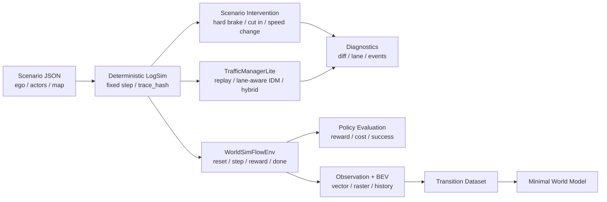
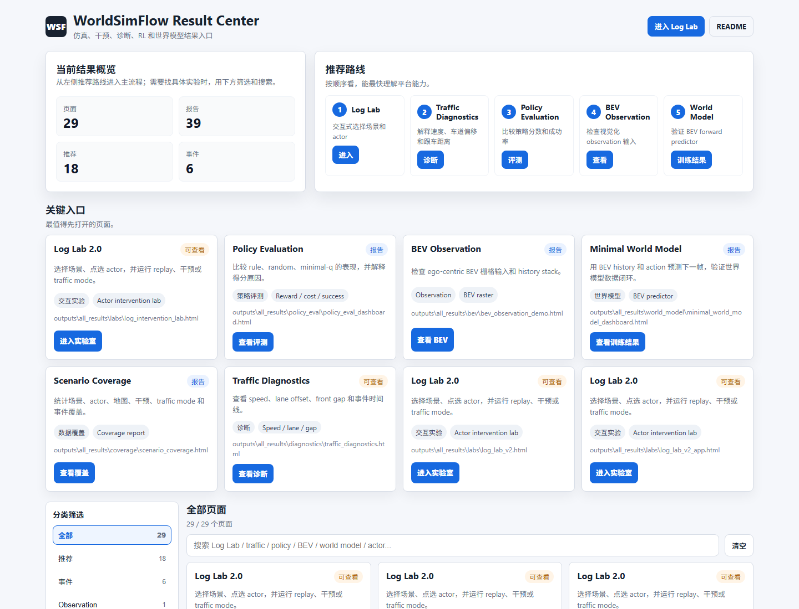
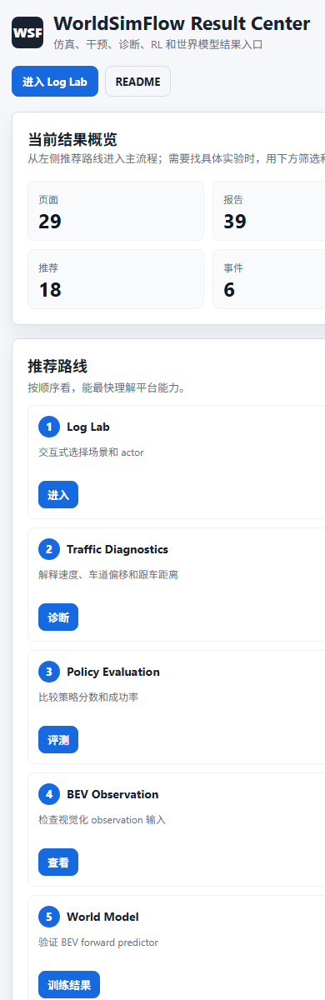
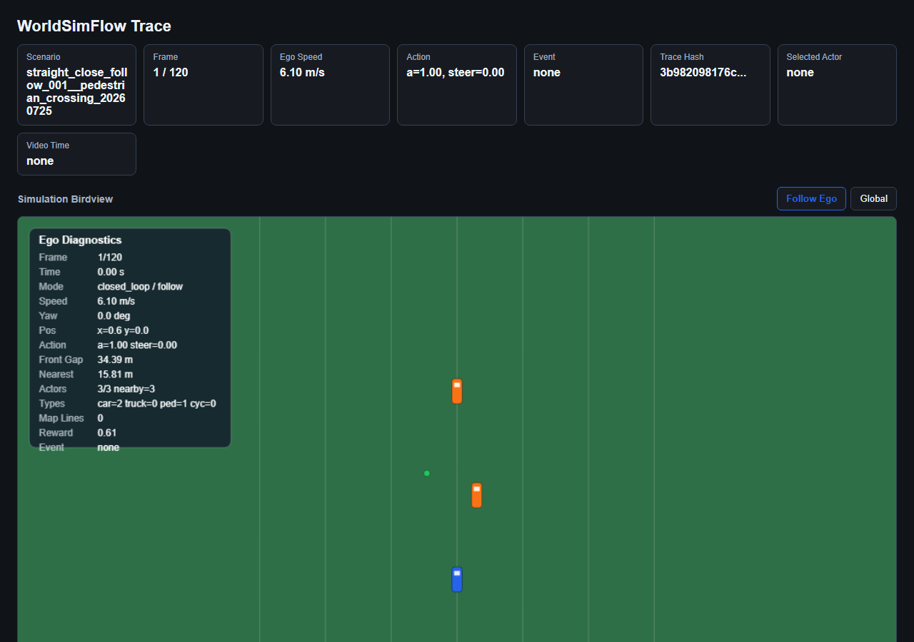

# WorldSimFlow

WorldSimFlow 是一个轻量自研的自动驾驶 LogSim、场景干预、闭环评测和世界模型数据平台。

它的目标不是做一个重型 3D 模拟器，而是把智驾仿真平台最核心的工程链路做清楚：统一场景输入、确定性回放、指定 actor 干预、地图约束、背景交通策略、健康监控、批量评测、RL observation、BEV transition dataset 和最小世界模型 demo。

## 一张图看懂项目



## 项目定位

一句话：

> WorldSimFlow 把 log-like 自动驾驶场景变成可复现、可干预、可解释、可批量评测，并且能导出 RL 和世界模型训练数据的轻量仿真闭环。

适合展示的能力：

| 方向 | 项目里怎么体现 |
|---|---|
| LogSim 回放 | `ScenarioLoader` + `ReplayBackend` + `MiniDrivingSimulator` |
| 仿真一致性 | fixed step、固定随机种子、`trace_hash` |
| 场景泛化 | hard_brake / cut_in / speed_change / lateral_shift |
| 地图约束 | `LaneGraph`、Frenet projection、drivable area |
| 背景交通 | lane-aware IDM、`TrafficManagerLite` hybrid traffic |
| 健康监控 | collision、offroad、stale_replay、non-finite state |
| 诊断解释 | `ScenarioDiff`、Traffic Diagnostics、Coverage Report |
| RL 闭环 | `WorldSimFlowEnv`、RewardBreakdown、CostInfo、DoneReason |
| 世界模型 | BEV history transition dataset、Minimal World Model demo |

## 目录结构

```text
WorldSimFlow
  configs/                  # 默认运行配置
  data/                     # Scenario JSON 样例和 open-log 转换样例
  docs/                     # 本地设计文档（不上传）
  outputs/                  # 生成的 HTML dashboard 和 JSON report
  scripts/                  # 可直接运行的实验入口
  src/worldsimflow/         # 核心 Python 包
    backends/               # Replay backend 抽象
    core/                   # 仿真、干预、交通、RL、世界模型核心模块
    policies.py             # rule / random / minimal-q 策略
    visualizer.py           # HTML birdview 渲染
  tests/                    # 回归测试
  pyproject.toml
  README.md
```

## 核心模块

| 模块 | 作用 |
|---|---|
| `scenario.py` | 读取 Scenario JSON，统一 ego、actors、map、metadata |
| `replay_backend.py` | 轻量确定性回放后端 |
| `sim.py` | 仿真 step 主循环和基础事件判断 |
| `flow.py` | 确定性流控和 trace hash |
| `target_intervention.py` | 指定 actor 反事实干预 |
| `lane_graph.py` | LaneGraph 和 Frenet 投影 |
| `traffic_policy.py` | IDMLitePolicy 等背景交通策略 |
| `traffic_manager.py` | replay / lane-aware IDM / hybrid 统一管理 |
| `rl_env.py` | RL 风格 reset / step 环境 |
| `observation.py` | state vector、normalized vector、space spec |
| `bev_observation.py` | BEV raster 和 history stack |
| `reward.py` | RewardBreakdown 和 CostInfo |
| `termination.py` | DoneReason 和 SuccessInfo |
| `transition_dataset.py` | observation transition JSONL 导出 |
| `world_model.py` | 最小世界模型 forward predictor |

## 快速开始

建议 Python 3.10+。

```powershell
cd D:\Git\Gongyu_RL_Simulator
pip install -e .
pip install pytest
```

基础 LogSim：

```powershell
python scripts\run_demo.py --scenario data/sample_scenario.json --steps 120 --render-html outputs/demo_trace.html
```

Waymo-like open-log 回放：

```powershell
python scripts\run_demo.py --scenario data/converted/openlog_waymo_2a1e44d405a6833f.json --steps 120 --render-html outputs/openlog_waymo_replay.html
```

生成结果中心：

```powershell
python scripts\build_launcher.py
```

打开：

```text
outputs\worldsimflow_launcher.html
```

策略评测：

```powershell
python scripts\evaluate_policies.py
```

导出 BEV transition dataset：

```powershell
python scripts\export_batch_transitions.py --include-bev --bev-history-length 3
```

最小世界模型 demo：

```powershell
python scripts\run_minimal_world_model_demo.py
```

完整测试：

```powershell
python -m pytest -q
```

## 仿真结果预览

**结果中心（响应式，桌面 + 移动端）**

| 桌面端 | 移动端 |
|---|---|
|  |  |

**行人横穿场景（LogSim + 干预回放）**



## 主要结果入口

| 页面 | 路径 |
|---|---|
| 结果中心 | `outputs/worldsimflow_launcher.html` |
| Log Lab 2.0 | `outputs/all_results/labs/log_lab_v2.html` |
| Policy Eval | `outputs/all_results/policy_eval/policy_eval_dashboard.html` |
| BEV Demo | `outputs/all_results/bev/bev_observation_demo.html` |
| Minimal World Model | `outputs/all_results/world_model/minimal_world_model_dashboard.html` |
| Batch Dataset | `outputs/all_results/datasets/worldsimflow_bev_history_v1/` |

## 下一步路线

| 优先级 | 下一步 | 目标 |
|---|---|---|
| P0 | Data Schema v1 | 固化 Scenario / Observation / Transition / BEV 字段、单位和 shape |
| P0 | Log Lab 实验配置保存 | 把界面选择保存成 experiment JSON，保证交互实验可复现 |
| P1 | Batch Experiment Runner 2.0 | 一次跑多场景、多策略、多干预，统一输出 report |
| P1 | Traffic actor 行为扩展 | 增加 lane-change intent、yield、pedestrian crossing policy |
| P1 | World Model rollout eval | 从单步预测扩展到多步 rollout 和一致性评测 |
| P2 | 大规模运行 | 并行 runner、任务恢复、异常归因和运行监控 |

## 设计原则

- 轻量：默认不依赖大型 3D 模拟器。
- 可复现：同输入、同策略、同配置应得到同样 trace hash。
- 可解释：每次运行都有 metrics、events、done reason、dashboard。
- 可扩展：仿真、交通、observation、RL、世界模型之间保持清晰接口。
